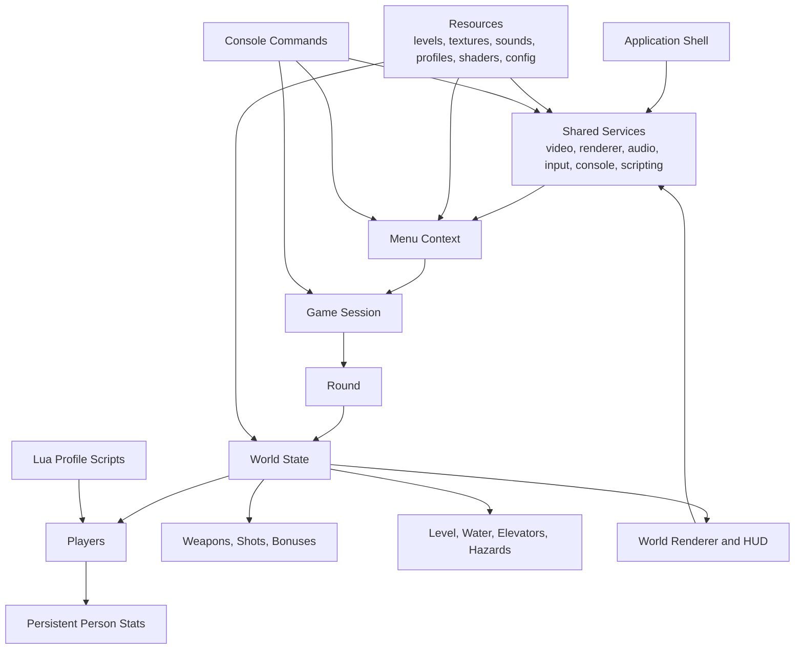

# Project Overview

Duel 6 Reloaded is a cross-platform, local-only 2D arena combat game in which 2 to 15 players compete in fast last-man-standing matches across resource-driven maps with persistent player stats, multiple rulesets, diverse weapons, timed bonuses, and profile-based customization. The repository combines a native desktop game client, a custom menu and HUD flow, file-based content packs for levels and assets, and optional Lua scripting hooks, so a feature-parity reimplementation must preserve the same session setup flow, round-based combat loop, scoreboard behavior, and data-driven customization model even if the underlying technology changes.

## Repository Structure

- `source/` - Main game code for application startup, menu flow, match orchestration, gameplay rules, rendering, audio, and persistence.
  - `source/aseprite/` - Aseprite animation import support for player art and animated content.
  - `source/bonus/` - Concrete bonus definitions for instant and timed pickups.
  - `source/collision/` - Collision helpers for actors, projectiles, and the arena.
  - `source/console/` - Built-in developer console, command parsing, variables, and console rendering.
  - `source/gamemodes/` - Rulesets for Deathmatch, Predator, and team-based variants.
  - `source/gui/` - Custom menu UI toolkit used by the roster and game setup screens.
  - `source/input/` - Keyboard and controller abstraction plus per-player control presets.
  - `source/json/` - Custom JSON reader and writer used by levels, profiles, and saved stats.
  - `source/math/` - Math primitives, matrices, vectors, and camera helpers.
  - `source/renderer/` - Renderer abstraction and backend-independent drawing contracts.
    - `source/renderer/gl1/` - Legacy OpenGL 1 renderer backend.
    - `source/renderer/gl4/` - Default OpenGL 4 renderer backend.
    - `source/renderer/es2/` - Experimental OpenGL ES 2 backend.
    - `source/renderer/es3/` - OpenGL ES 3 backend with shader-based rendering.
  - `source/script/` - Scripting interfaces for player and round hooks.
    - `source/script/lua/` - Lua-backed script loader and runtime bindings.
  - `source/weapon/` - Weapon and projectile framework shared by all guns.
    - `source/weapon/impl/` - Concrete weapon and shot behavior definitions.
- `resources/` - Runtime content expected beside the executable when the game launches.
  - `resources/data/` - Core config, tile metadata, font, and application icon files.
  - `resources/levels/` - Shipped arena definitions stored as JSON.
  - `resources/profiles/` - Per-player customization packs for skins, sounds, and optional scripts.
  - `resources/shaders/` - Shader programs used by modern render backends.
    - `resources/shaders/gl4/` - OpenGL 4 shader sources.
    - `resources/shaders/gles3/` - OpenGL ES 3 shader sources.
  - `resources/sound/` - Music and sound effects for global events, players, and weapons.
    - `resources/sound/game/` - Round start, game over, and water effect sounds.
    - `resources/sound/player/` - Default player hit, death, and pickup sounds.
    - `resources/sound/weapon/` - Weapon firing and impact sounds.
  - `resources/textures/` - Backgrounds, tiles, pickups, player art, water, and weapon visuals.
- `CMakeLists.txt` - Canonical native build definition, dependency wiring, and renderer switches.
- `.travis.yml` - Legacy CI pipeline for dependency install, compilation, and tagged release packaging.
- `README.md` - Project introduction, historical context, and high-level feature summary.

## Build & Development Commands

Docker-based commands are the only supported and allowed way to build, test, lint, type-check, package, and run this project. Native host compilation commands are not supported.

Build (or refresh) the local build container image:

```sh
docker build -t duel6r-build:local .
```

Build a release runtime bundle (default renderer is `gl4`, but `gl1`, `es2`, and `es3` are also supported):

```sh
docker run --rm \
  -e OUTPUT_DIR=build \
  -e BUILD_TYPE=Release \
  -e D6R_RENDERER=gl4 \
  -e D6R_WITH_LUA=ON \
  -v "$PWD:/workspace" \
  duel6r-build:local
```

Run locally from the generated runtime bundle:

```sh
./build/duel6r
```

Build a debug runtime bundle:

```sh
docker run --rm \
  -e OUTPUT_DIR=build-debug \
  -e BUILD_TYPE=Debug \
  -e D6R_RENDERER=gl4 \
  -e D6R_WITH_LUA=ON \
  -v "$PWD:/workspace" \
  duel6r-build:local
```

Debug locally with gdb inside the container:

```sh
docker run --rm -it \
  --cap-add=SYS_PTRACE \
  --security-opt seccomp=unconfined \
  -e OUTPUT_DIR=build-debug \
  -e BUILD_TYPE=Debug \
  -v "$PWD:/workspace" \
  duel6r-build:local \
  gdb --args /workspace/build-debug/duel6r
```

Test locally (build + automated tests via `ctest` inside the container):

```sh
docker run --rm \
  -e OUTPUT_DIR=build-test \
  -e BUILD_TYPE=Release \
  -e BUILD_TESTING=ON \
  -e D6R_RENDERER=gl4 \
  -e D6R_WITH_LUA=ON \
  -e RUN_TESTS=ON \
  -v "$PWD:/workspace" \
  duel6r-build:local
```

Run only the automated test binary (without packaging runtime bundle):

```sh
docker run --rm \
  -e BUILD_TYPE=Release \
  -e BUILD_TESTING=ON \
  -e D6R_RENDERER=gl4 \
  -e D6R_WITH_LUA=ON \
  -e RUN_TESTS=ON \
  -v "$PWD:/workspace" \
  duel6r-build:local
```

Lint locally (no dedicated lint target exists in this repository):

```sh
docker run --rm \
  -e OUTPUT_DIR=build-lint \
  -e BUILD_TYPE=Debug \
  -e D6R_RENDERER=gl4 \
  -e D6R_WITH_LUA=ON \
  -v "$PWD:/workspace" \
  duel6r-build:local
```

Type-check locally (containerized compilation is the only type-safety gate in the current codebase):

```sh
docker run --rm \
  -e OUTPUT_DIR=build-typecheck \
  -e BUILD_TYPE=Debug \
  -e D6R_RENDERER=gl4 \
  -e D6R_WITH_LUA=ON \
  -v "$PWD:/workspace" \
  duel6r-build:local
```

Create a release artifact similar to the legacy CI deploy flow:

```sh
docker run --rm \
  -e OUTPUT_DIR=build-release \
  -e BUILD_TYPE=Release \
  -e D6R_RENDERER=gl4 \
  -e D6R_WITH_LUA=ON \
  -v "$PWD:/workspace" \
  duel6r-build:local
(
  cd build-release &&
  zip -r duel-nightly.zip duel6r data levels profiles shaders sound textures
)
```

## Architecture Notes



The architecture is organized around a small set of shared application services and two main runtime contexts: menu setup and gameplay. `Application` owns long-lived platform services such as rendering, audio, input, the in-game console, and script loading; `Menu` prepares a session by loading profiles, levels, saved people, and controller assignments; `Game` holds the persistent match-level state across rounds; `Round` owns one arena instance; and `World` contains the live entities and hazards for that arena. Content is file-driven: maps, block metadata, profiles, sounds, textures, shaders, and startup commands are loaded from `resources/`, then interpreted by the menu, gameplay rules, and renderer. A parity reimplementation should preserve this separation between shared platform services, session setup, match progression, per-round world state, and data-driven content packs, because most user-visible behavior emerges from the interaction between those layers rather than from any single subsystem.

## Testing Strategy

- Unit testing - The repository now includes an in-tree C++ test executable (`duel6r-tests`) registered in `ctest`. Current coverage targets deterministic logic and data validation (math, formatting, JSON parser/writer, and shipped JSON resource schema checks).
- Integration testing - The existing project validates integration primarily through a full native build and startup path, so local validation should include compiling from scratch, copying runtime assets beside the executable, and confirming the menu, profile loading, controller scan, and match start all work.
- End-to-end testing - Manual smoke tests should cover the full player loop: create at least two players, start a match, move, jump, crouch, shoot, pick up or swap weapons, collect bonuses, interact with water and elevators, finish a round, inspect the scoreboard, and return to the menu.
- Mode coverage - Manual verification should include at least one Deathmatch session, one Predator session, and one team session with friendly fire behavior, plus split-screen toggling in matches with fewer than five players.
- Console and scripting coverage - Validation should also confirm that the console opens during menu and gameplay, runtime commands alter behavior, and a profile script can observe match state and drive player actions.
- CI behavior - GitHub Actions nightly and develop sanity flows run automated tests as part of the containerized build (`BUILD_TESTING=ON`, `RUN_TESTS=ON`) and fail the job if `ctest` reports failures. Legacy `.travis.yml` remains historical context only.

## Features

Detailed description of functional requirements is in [docs/features.md](docs/features.md). They are non-negotiable.
Do not change them unless explicitly asked.
If your task contradicts any of the requirements, explicitly ask what to do and offer options for resolution.

## Branching strategy

CI/CD workflow is leveraging GitHub Actions.

- Branch: `feature-*`
  - Contains: unstable changes, prototypes, etc.
  - Requirements: Game compilation successful

- Branch: `develop`
  - Contains: bleeding edge features
  - Requirements: Passes basic sanity checks and linting
  - Tags:
    - `sanity` - confirms passing the sanity and linting checks
    - `nightly` - nightly build artifacts are created and published to GitHub

- Branch: `master`
  - Contains: stable version
  - Requirements: Nightly version can be executed successfully
  - Tags:
    - `released` - Release artifacts are created and published to GitHub
