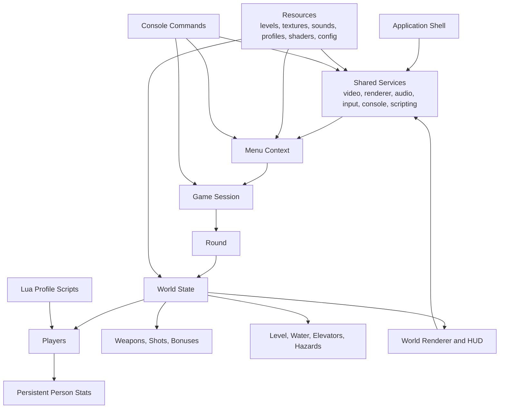

# Project Overview

Duel 6 Reloaded is a cross-platform, local-only 2D arena combat game in which 2 to 15 players compete in fast last-man-standing matches across resource-driven maps with persistent player stats, multiple rulesets, diverse weapons, timed bonuses, and profile-based customization. The repository combines a native desktop game client, a custom menu and HUD flow, file-based content packs for levels and assets, and optional Lua scripting hooks, so a feature-parity reimplementation must preserve the same session setup flow, round-based combat loop, scoreboard behavior, and data-driven customization model even if the underlying technology changes.

## Repository Structure

- `source/` - Main game code for application startup, menu flow, match orchestration, gameplay rules, rendering, audio, and persistence.
  - `source/aseprite/` - Aseprite animation import support for player art and animated content.
  - `source/bonus/` - Concrete bonus definitions for instant and timed pickups.
  - `source/collision/` - Collision helpers for actors, projectiles, and the arena.
  - `source/console/` - Built-in developer console, command parsing, variables, and console rendering.
  - `source/gamemodes/` - Rulesets for Deathmatch, Predator, and team-based variants.
  - `source/gui/` - Custom menu UI toolkit used by the roster and game setup screens.
  - `source/input/` - Keyboard and controller abstraction plus per-player control presets.
  - `source/json/` - Custom JSON reader and writer used by levels, profiles, and saved stats.
  - `source/math/` - Math primitives, matrices, vectors, and camera helpers.
  - `source/renderer/` - Renderer abstraction and backend-independent drawing contracts.
    - `source/renderer/gl1/` - Legacy OpenGL 1 renderer backend.
    - `source/renderer/gl4/` - Default OpenGL 4 renderer backend.
    - `source/renderer/es2/` - Experimental OpenGL ES 2 backend.
    - `source/renderer/es3/` - OpenGL ES 3 backend with shader-based rendering.
  - `source/script/` - Scripting interfaces for player and round hooks.
    - `source/script/lua/` - Lua-backed script loader and runtime bindings.
  - `source/weapon/` - Weapon and projectile framework shared by all guns.
    - `source/weapon/impl/` - Concrete weapon and shot behavior definitions.
- `resources/` - Runtime content expected beside the executable when the game launches.
  - `resources/data/` - Core config, tile metadata, font, and application icon files.
  - `resources/levels/` - Shipped arena definitions stored as JSON.
  - `resources/profiles/` - Per-player customization packs for skins, sounds, and optional scripts.
  - `resources/shaders/` - Shader programs used by modern render backends.
    - `resources/shaders/gl4/` - OpenGL 4 shader sources.
    - `resources/shaders/gles3/` - OpenGL ES 3 shader sources.
  - `resources/sound/` - Music and sound effects for global events, players, and weapons.
    - `resources/sound/game/` - Round start, game over, and water effect sounds.
    - `resources/sound/player/` - Default player hit, death, and pickup sounds.
    - `resources/sound/weapon/` - Weapon firing and impact sounds.
  - `resources/textures/` - Backgrounds, tiles, pickups, player art, water, and weapon visuals.
- `CMakeLists.txt` - Canonical native build definition, dependency wiring, and renderer switches.
- `.travis.yml` - Legacy CI pipeline for dependency install, compilation, and tagged release packaging.
- `README.md` - Project introduction, historical context, and high-level feature summary.

## Build & Development Commands

Install native dependencies on Ubuntu or Debian:

```sh
sudo apt-get update
sudo apt-get install -y build-essential cmake libsdl2-dev libsdl2-image-dev libsdl2-mixer-dev libsdl2-ttf-dev libglew-dev liblua5.3-dev zip gdb
```

Configure and build a release binary (default renderer is `gl4`, but `gl1`, `es2`, and `es3` are also supported):

```sh
cmake -S . -B build -DCMAKE_BUILD_TYPE=Release -DD6R_RENDERER=gl4 -DD6R_WITH_LUA=ON
cmake --build build -j"$(nproc)"
```

Run locally by staging the runtime assets beside the executable:

```sh
cp -R resources/* build/
./build/duel6r
```

Configure and run a debug build:

```sh
cmake -S . -B build-debug -DCMAKE_BUILD_TYPE=Debug -DD6R_RENDERER=gl4 -DD6R_WITH_LUA=ON
cmake --build build-debug -j"$(nproc)"
cp -R resources/* build-debug/
gdb --args ./build-debug/duel6rd
```

Test locally (the repository has no automated test suite, so a clean native build is the current CI-equivalent validation step):

```sh
cmake -S . -B build-test -DCMAKE_BUILD_TYPE=Release -DD6R_RENDERER=gl4 -DD6R_WITH_LUA=ON
cmake --build build-test -j"$(nproc)"
```

Lint locally (no dedicated lint target exists in this repository):

```sh
cmake -S . -B build-lint -DCMAKE_BUILD_TYPE=Debug -DD6R_RENDERER=gl4 -DD6R_WITH_LUA=ON
cmake --build build-lint -j"$(nproc)"
```

Type-check locally (native compilation is the only type-safety gate in the current codebase):

```sh
cmake -S . -B build-typecheck -DCMAKE_BUILD_TYPE=Debug -DD6R_RENDERER=gl4 -DD6R_WITH_LUA=ON
cmake --build build-typecheck -j"$(nproc)"
```

Create a release artifact similar to the legacy CI deploy flow:

```sh
cmake -S . -B build-release -DCMAKE_BUILD_TYPE=Release -DD6R_RENDERER=gl4 -DD6R_WITH_LUA=ON
cmake --build build-release -j"$(nproc)"
cp -R resources/* build-release/
(
  cd build-release &&
  zip -r duel-nightly.zip duel6r data levels profiles shaders sound textures
)
```

## Architecture Notes



The architecture is organized around a small set of shared application services and two main runtime contexts: menu setup and gameplay. `Application` owns long-lived platform services such as rendering, audio, input, the in-game console, and script loading; `Menu` prepares a session by loading profiles, levels, saved people, and controller assignments; `Game` holds the persistent match-level state across rounds; `Round` owns one arena instance; and `World` contains the live entities and hazards for that arena. Content is file-driven: maps, block metadata, profiles, sounds, textures, shaders, and startup commands are loaded from `resources/`, then interpreted by the menu, gameplay rules, and renderer. A parity reimplementation should preserve this separation between shared platform services, session setup, match progression, per-round world state, and data-driven content packs, because most user-visible behavior emerges from the interaction between those layers rather than from any single subsystem.

## Testing Strategy

- Unit testing - No unit-test suite is bundled today, so a reimplementation should add focused coverage for rules, scoring, profile loading, map parsing, and persistence while treating the original project as behavior reference rather than test oracle.
- Integration testing - The existing project validates integration primarily through a full native build and startup path, so local validation should include compiling from scratch, copying runtime assets beside the executable, and confirming the menu, profile loading, controller scan, and match start all work.
- End-to-end testing - Manual smoke tests should cover the full player loop: create at least two players, start a match, move, jump, crouch, shoot, pick up or swap weapons, collect bonuses, interact with water and elevators, finish a round, inspect the scoreboard, and return to the menu.
- Mode coverage - Manual verification should include at least one Deathmatch session, one Predator session, and one team session with friendly fire behavior, plus split-screen toggling in matches with fewer than five players.
- Console and scripting coverage - Validation should also confirm that the console opens during menu and gameplay, runtime commands alter behavior, and a profile script can observe match state and drive player actions.
- CI behavior - The current CI definition in `.travis.yml` only installs dependencies, runs `cmake .. && make`, and creates a release zip on tagged builds, so there are no automated gameplay or regression tests in CI today.

## Features

### Match Setup and Session Flow

- The game must support local multiplayer sessions with a minimum of 2 players and a maximum of 15 simultaneous players.
- The main menu must let players build a roster from persistent people records, assign control schemes, add or remove active players, shuffle player order, clear stored stats, and start or exit a session.
- The setup flow must expose selectable rulesets for free-for-all play, Predator, and team-based variants, along with toggles that affect assist handling and sudden-death water behavior.
- Session state must persist across multiple rounds so that wins, kills, deaths, assists, penalties, and match progress accumulate until the session ends.

### Player Controls and Core Actions

- The game must support multiple predefined keyboard layouts plus SDL-style gamepad input, all mapped to the abstract actions move left, move right, jump, crouch, shoot, pick or swap weapon, and show status.
- During play, each player must be able to walk, jump, crouch, double-jump, shoot, pick up dropped weapons, swap away from a current weapon, and request an on-screen status display.
- Newly spawned players must receive brief spawn protection and a temporary location indicator so they can reorient after entering the round.
- Matches with fewer than five players must support toggling between a full-arena presentation and split-screen player views.

### World, Maps, and Environmental Hazards

- Arenas must be data-driven and selected from a shipped library of JSON-authored maps; the current repository includes 28 bundled maps.
- Levels must support solid terrain, water, waterfalls, moving elevators or platforms, decorative sprites, and map-specific layouts that influence combat routes and safe zones.
- Water must act as an environmental hazard by draining air, then life, with multiple water variants that differ in severity.
- Sudden death must be represented by rising water that pressures the remaining players when a round reaches a late-game state or when the relevant setup toggle is enabled.

### Combat, Weapons, and Pickups

- The game must provide a roster of distinct weapons with different reload cadence, ammo behavior, damage output, and special traits; the current code defines 17 weapons, with configuration deciding which are enabled by default.
- Weapon behaviors must remain visibly differentiated at a high level, including chargeable weapons, splash-damage weapons, rapid-fire weapons, beam-style weapons, and status-effect or novelty weapons.
- Players must begin rounds with a random enabled weapon and must drop their current weapon on death so that other players can claim it.
- The game must spawn both temporary bonuses and dropped-weapon pickups into the world during live rounds.

### Bonus Effects and Entity Interactions

- The game must support instant pickups such as extra life, reduced life, full heal, and additional bullets, plus timed effects such as faster reload, faster movement, powerful shots, invulnerability, invisibility, splitfire, vampire shots, infinite ammo, and snorkel.
- Bonus effects must alter how players interact with the world and with other combatants, for example by changing movement speed, survivability, underwater behavior, projectile output, or health recovery.
- Player-versus-player interaction must include direct damage, splash damage, weapon theft through pickups after death, assists based on contribution, and penalties for self-destructive or team-harming actions when rules require it.
- Player-versus-environment interaction must include drowning, movement penalties in water, platform riding, and survival pressure from escalating hazards.

### Game Modes, Winning Conditions, and Scoring

- Deathmatch must reward the sole surviving player when a round ends.
- Predator must designate one player as the predator and change the balance of visibility, survivability, and win conditions between the predator and the remaining players.
- Team modes must support 2-team, 3-team, and 4-team variants, each with friendly fire enabled or disabled, while keeping team identity visually readable.
- The scoring model must persist wins, kills, assists, penalties, deaths, shots fired, accuracy, damage, points, and Elo-style ranking data, and it must visibly discourage suicide, drowning, and invalid kills through negative scoring.
- The UI must surface both live rankings during play and fuller score summaries at round end or game end.

### Profiles, Customization, and Persistence

- The game must support name-based player profiles stored on disk, with optional skin colors, cosmetic choices, event sounds, and Lua behavior hooks.
- If a matching profile is absent, the game must still generate a valid playable participant using default sounds and randomized visual customization.
- Persistent people records must retain long-term statistics between launches and feed the menu roster on the next startup.
- Team modes must be allowed to override part of a player's look so that team color remains identifiable even when profiles are customized.

### Console, Configuration, and Scripting

- The game must provide an in-game console that is available from both menu and gameplay contexts for runtime inspection and live configuration.
- Startup configuration must be file-driven so that default audio, weapon availability, and other session-affecting settings can be changed without recompiling.
- Console commands must be able to alter runtime behavior such as renderer diagnostics, FPS display, music and volume, round count, weapon enablement, map selection, ghosting, and controller rescans.
- Lua profile scripts must be able to inspect match context at a high level, observe the controlled player, other players, the level, and active shots, and influence play through input-like actions rather than unrestricted world editing.

## Branching strategy

CI/CD workflow is leveraging GitHub Actions.

- Branch: `feature-*`
  - Contains: unstable changes, prototypes, etc.
  - Requirements: Game compilation successful

- Branch: `develop`
  - Contains: bleeding edge features
  - Requirements: Passes basic sanity checks and linting
  - Tags:
    - `sanity` - confirms passing the sanity and linting checks
    - `nightly` - nightly build artifacts are created and published to GitHub

- Branch: `master`
  - Contains: stable version
  - Requirements: Nightly version can be executed successfully
  - Tags:
    - `released` - Release artifacts are created and published to GitHub