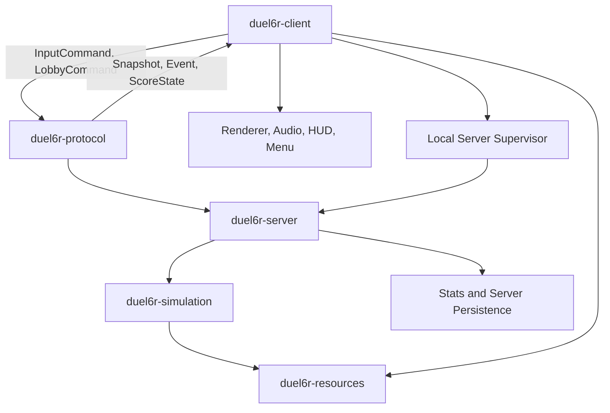

# Server/Client Split Architecture Plan

## Goal

Split Duel 6 Reloaded from the current single-process local runtime into two standalone modules:

- an authoritative headless server that owns all gameplay simulation and match truth;
- a client that owns local input, menu/lobby UI, rendering, audio, HUD, and connection orchestration.

The client must support two connection modes:

1. Remote Server: connect to an externally running server by endpoint.
2. Local Game: automatically start a local server instance and connect to it through the same protocol used for remote servers.

This design preserves the required feature set documented in [`docs/features.md`](../docs/features.md:3), including local multiplayer setup, round-based combat, multiple rulesets, persistent stats, data-driven resources, console behavior, and Lua profile hooks.

## Current state summary

The current application is a local monolith:

- [`Application`](../source/Application.h:40) owns global services, including rendering, input, sound, console, scripting, menu, and game state.
- [`AppService`](../source/AppService.h:40) groups client-only services such as video, font, textures, input, and sound with scripting.
- [`Menu`](../source/Menu.h:55) owns roster setup, profile loading, controller assignment, stats display, level selection, settings, and direct game launch.
- [`Game`](../source/Game.h:53) owns match-level state, players, game mode, current round, rendering support, and input event handling.
- [`Round`](../source/Round.h:40) owns one live round, world updates, winner checks, split-screen behavior, script hooks, and local key handling.
- [`World`](../source/World.h:43) owns live entities such as players, level, shots, bonuses, elevators, fire, explosions, messages, and water.
- [`CMakeLists.txt`](../CMakeLists.txt:77) currently defines one large source list for one primary executable-oriented build.

The split therefore requires more than adding sockets: simulation ownership, services, persistence, rendering, and menu flow must be separated into explicit module boundaries.

## Target architecture

### Authoritative server module

The server is the sole authority for gameplay truth. It should be able to run without a window, renderer, texture manager, audio device, or local input system.

Server responsibilities:

- Own lobby/session lifecycle: connect, join, configure, ready, start match, start round, end round, end match, return to lobby, disconnect.
- Validate roster size and rules required by [`docs/features.md`](../docs/features.md:3), including 2 to 15 players, game modes, teams, assistance, quick liquid, and round limits.
- Own the authoritative simulation currently rooted in [`Game`](../source/Game.h:53), [`Round`](../source/Round.h:40), and [`World`](../source/World.h:43).
- Own game mode rules, winner determination, scoring, penalties, Elo-relevant results, round progression, and match-over conditions.
- Own deterministic random seeds for level order, mirrored levels, spawn positions, starting weapons, bonus spawns, dropped weapons, and any future randomized behavior.
- Accept input commands from clients and apply them only at valid simulation ticks.
- Reject stale, impossible, malformed, or unauthorized input commands.
- Broadcast authoritative snapshots, deltas, score state, and gameplay events.
- Decide stats ownership rules for remote play and local play.
- Enforce resource compatibility with version and content hashes.
- Execute Lua only according to an explicit trust policy.
- Provide server console/admin commands separately from client console UI.

The server must not depend on [`Video`](../source/Video.h), [`TextureManager`](../source/TextureManager.h), [`Sound`](../source/Sound.h), GUI classes under [`source/gui`](../source/gui), or renderer backends under [`source/renderer`](../source/renderer).

### Client module

The client becomes a networked presentation and input application. It keeps the player-facing experience but no longer mutates authoritative gameplay state directly.

Client responsibilities:

- Own the main menu and lobby UI.
- Offer Local Game and Remote Server choices.
- Collect local keyboard and controller input through the existing input abstractions.
- Map local devices to server-assigned player slots.
- Send input commands with sequence numbers and target simulation ticks.
- Maintain a replicated read-only state cache from authoritative snapshots.
- Render the world, HUD, scoreboards, menus, and console overlays from replicated state.
- Play sounds from server event messages and local UI actions.
- Load textures, sounds, shaders, fonts, profile cosmetics, and local presentation resources.
- Interpolate remote entity positions and optionally predict locally controlled players.
- Correct predicted state from authoritative server snapshots.
- Supervise an automatically launched local server process for Local Game mode.
- Terminate the local server when the local session ends, unless explicitly configured to keep it alive.

Client-side code should keep using rendering-oriented classes such as [`WorldRenderer`](../source/WorldRenderer.h), but those classes should read replicated state DTOs rather than directly reading mutable authoritative [`World`](../source/World.h:43) objects.

### Shared modules

Shared modules should be built so server and client compile against the same schemas and deterministic rules without dragging in client-only dependencies.

Recommended shared targets:

- `duel6r_common`: primitive types, math, formatting, file utilities, ids, deterministic random, and platform-neutral helpers.
- `duel6r_resources`: level loading, blocks, profile metadata, settings schemas, content hashing, and resource validation.
- `duel6r_simulation`: deterministic authoritative gameplay logic, including players, world, weapons, bonuses, game modes, scoring, collisions, water, elevators, and round progression.
- `duel6r_protocol`: protocol DTOs, serialization, handshake, lobby messages, input commands, snapshots, events, score synchronization, and disconnect reasons.
- `duel6r_client_runtime`: menu, input, video, renderer, audio, HUD, console UI, local server supervisor, and replicated-state renderer adapters.
- `duel6r_server_runtime`: headless server loop, network host, lobby/session management, server console/admin, persistence, and simulation driver.

## Runtime flows

### Remote server flow

1. User starts the client executable.
2. Client opens the menu and displays Remote Server and Local Game choices.
3. User selects Remote Server and enters host, port, and optional password/token.
4. Client connects to the endpoint.
5. Client and server exchange protocol version, build version, feature flags, and content hashes.
6. Server accepts or rejects the client with a structured reason.
7. Accepted clients enter the lobby.
8. Host/admin selects levels, player slots, profiles, game mode, assistance, quick liquid, and round count.
9. Server broadcasts lobby state until all required clients are ready.
10. Server starts the match and sends an initial full snapshot.
11. Clients send input commands every tick or at a fixed input rate.
12. Server runs authoritative simulation and broadcasts snapshots/events.
13. Clients render replicated state and play event-driven audio/HUD effects.
14. Server ends rounds and match, then publishes final score/stat state.
15. Clients return to lobby or disconnect.

### Local game flow

1. User starts the client executable.
2. Client opens the menu and displays Remote Server and Local Game choices.
3. User selects Local Game.
4. Client starts the bundled headless server executable as a child process.
5. Client passes local-only configuration, selected port or pipe name, resource path, and optional temporary session token.
6. Client waits for a server-ready signal.
7. Client connects to `127.0.0.1` or a local IPC endpoint using the same protocol as Remote Server mode.
8. Gameplay proceeds exactly like remote mode.
9. On session end, client sends graceful shutdown to the local server.
10. Client terminates the local server process if graceful shutdown times out.

Local Game must not use a private direct-call path into simulation. The loopback protocol path is mandatory to prevent divergence between local and remote behavior.

## Protocol design

### Channels

Use separate logical channels even if they share one transport implementation:

- Reliable ordered: handshake, lobby, settings, ready/start, round transitions, score commits, disconnects, admin commands.
- Unreliable sequenced: high-frequency world snapshots.
- Reliable sequenced or redundant unreliable: client input commands, depending on selected transport.

### Core message families

#### Handshake messages

Fields:

- protocol version;
- build version;
- feature flags;
- resource hash manifest;
- preferred compression;
- authentication token or local-session token;
- client display name and requested profile metadata.

Failure reasons:

- incompatible protocol;
- incompatible executable version;
- content hash mismatch;
- server full;
- authentication failed;
- match already in incompatible state;
- banned or duplicate identity.

#### Lobby messages

Fields:

- client id;
- player slot ids;
- selected person/profile metadata;
- team assignment;
- selected control ownership;
- selected game mode;
- selected levels;
- settings such as assistance, quick liquid, and max rounds;
- ready flags;
- host/admin rights.

#### Input command messages

Fields:

- client id;
- player slot id;
- input sequence number;
- target simulation tick;
- action bitset for move left, move right, jump, crouch, shoot, pick/swap weapon, and show status;
- optional analog/device metadata if needed later.

The server acknowledges applied input sequence numbers in snapshots so clients can discard prediction history.

#### Snapshot messages

Fields:

- snapshot tick;
- baseline snapshot id for deltas;
- match phase;
- round number and timers;
- level id and mirror flag;
- water state;
- player states;
- shot states;
- bonus states;
- elevator states;
- fire/explosion visual states;
- score state;
- message queue state or event references.

Full snapshots are required on join, reconnect, baseline loss, or protocol resync. Delta snapshots are preferred during normal gameplay.

#### Event messages

Events should carry presentation triggers that clients cannot safely infer from snapshots alone:

- weapon fire;
- impact/explosion;
- player hit;
- player death;
- bonus pickup;
- weapon pickup/drop;
- drowning/water transitions;
- round start/end;
- game over;
- score tab updates;
- world info messages;
- sound trigger ids;
- HUD indicators.

Events must be idempotent or include event ids so clients can ignore duplicates.

#### Disconnect and shutdown messages

Fields:

- reason code;
- human-readable detail;
- reconnect token when supported;
- final score/stat payload when relevant;
- local server shutdown acknowledgement.

## State replication model

### Server-side state

Server state remains canonical and mutable. It should use stable ids for every replicated entity:

- players;
- shots;
- bonuses;
- elevators;
- explosions;
- fire effects;
- transient HUD/world messages where needed.

### Client-side replicated state

Client state should be a render model, not the authoritative simulation object graph. It may be stored as:

- last confirmed full snapshot;
- current interpolated render state;
- pending delta baselines;
- local prediction buffer for controlled players;
- event queue for audio/HUD effects.

### Prediction and interpolation

Minimum viable remote play:

- interpolate all replicated entities between snapshots;
- predict only locally controlled player movement and basic input response;
- do not predict weapon hits, scoring, pickups, or deaths initially;
- snap or smooth-correct from authoritative snapshots.

Later improvement:

- deterministic client-side prediction for movement and weapon cooldown display;
- lag compensation for hits only if the weapon model requires it;
- replay local inputs after acknowledged server tick for smoother local controls.

## Ownership rules

### Profiles

Client-owned:

- local profile cosmetics;
- skin and sound preferences;
- local display name proposal;
- local controller assignment.

Server-owned:

- accepted player identity for the session;
- gameplay-relevant profile validation;
- team color overrides;
- allowed script policy;
- authoritative score/stat updates.

### Persistent stats

Recommended policy:

- Local Game: local server may write stats to the local user data store after match completion.
- Remote Server: remote server owns authoritative match results and may either persist server-side stats or return signed/stateless match results to clients.
- Client must not unilaterally write remote match results as trusted long-term stats.

### Lua scripting

Recommended policy:

- Local Game can allow existing local Lua scripts if explicitly enabled.
- Remote Server should not execute client-supplied Lua.
- Remote Server may run server-installed trusted scripts only.
- Client-side Lua, if retained, should be cosmetic/UI-only and must not influence authoritative simulation except through normal input commands.

## Build and packaging plan

Refactor [`CMakeLists.txt`](../CMakeLists.txt:77) from one monolithic source list into layered targets:

- `duel6r_common` static library or object library;
- `duel6r_resources` static library;
- `duel6r_simulation` static library;
- `duel6r_protocol` static library;
- `duel6r_client_runtime` static library;
- `duel6r_server_runtime` static library;
- `duel6r-client` executable;
- `duel6r-server` executable;
- optional temporary `duel6r-legacy` executable.

Packaging:

- Client package: client executable, local server executable, textures, shaders, sounds, fonts, profiles, levels, data, and config.
- Server package: server executable, levels, gameplay data, server config, optional trusted scripts, and no renderer/audio assets unless validation requires them.
- Development package: both executables plus protocol test tools and deterministic replay fixtures.

## Migration plan

1. Establish shared module boundaries while preserving the current executable.
2. Extract deterministic simulation services out of client service dependencies.
3. Replace direct local input mutation with a local input command queue.
4. Add stable replicated ids to players and world entities.
5. Add snapshot DTOs and serialize current authoritative state.
6. Create a headless server runtime that can run one match without rendering.
7. Add loopback client connection to the headless server.
8. Change rendering to consume replicated client state rather than mutable authoritative state.
9. Add event DTOs for sound, HUD, message queue, and scoreboard updates.
10. Add Local Game server process spawning and lifecycle supervision.
11. Add Remote Server endpoint UI and connection handling.
12. Add snapshot interpolation and minimal local player prediction.
13. Move persistent stats and Lua policies into explicit server/client contracts.
14. Split [`CMakeLists.txt`](../CMakeLists.txt:77) into final client/server/shared targets.
15. Remove direct client access to authoritative [`Game`](../source/Game.h:53), [`Round`](../source/Round.h:40), and [`World`](../source/World.h:43) mutation paths.

## Validation gates

All validation must use the repository's Docker-based build rules.

Automated gates:

- containerized compile for client and server;
- deterministic simulation replay from fixed seed and fixed inputs;
- protocol serialization round-trip tests;
- snapshot/delta apply tests;
- content hash mismatch tests;
- local server startup/shutdown tests;
- loopback client-server smoke test;
- remote two-client smoke test where practical in CI.

Manual feature-parity gates:

- roster setup with 2 to 15 players;
- controller assignment and local multi-controller play;
- Deathmatch, Predator, and team modes;
- assistance and quick liquid settings;
- round limits and scoreboard flow;
- split-screen behavior for fewer than five players, mapped to replicated render views;
- water, elevators, weapons, dropped weapons, bonuses, and sudden death;
- persistent stats after Local Game;
- console in menu and gameplay;
- trusted Lua behavior in Local Game and explicit rejection/disablement in untrusted Remote Server mode.

## Risks and mitigations

| Risk | Impact | Mitigation |
| --- | --- | --- |
| Simulation is not deterministic | Divergent prediction and difficult tests | Server remains authoritative; add deterministic replay tests before client prediction expands. |
| Current classes mix rendering and simulation | Slow extraction | Introduce DTO adapters first, then move logic module by module. |
| Latency hurts combat feel | Poor remote play experience | Start with interpolation and local movement prediction; add reconciliation and selective lag compensation later. |
| Lua trust boundary is unclear | Remote code execution or cheating | Server executes only trusted installed scripts; client scripts become cosmetic or local-only. |
| Profile/stat ownership conflicts | Cheating or lost progress | Define Local Game and Remote Server persistence rules before remote stat writing. |
| Resource mismatch | Crashes or unfair play | Handshake must compare content hash manifests before joining. |
| Local server lifecycle leaks processes | Poor UX | Add readiness, heartbeat, graceful shutdown, timeout, and forced termination. |
| Build split is too large for one step | Long-lived broken branch | Use staged targets and keep legacy executable until client/server path is validated. |

## Initial implementation checklist

- Create protocol DTO headers without transport dependency.
- Add stable entity ids to simulation-visible objects.
- Add fixed-tick simulation driver separate from rendering frame time.
- Introduce server service facade that excludes [`Video`](../source/Video.h), [`TextureManager`](../source/TextureManager.h), [`Sound`](../source/Sound.h), and GUI dependencies.
- Introduce client replicated-state model.
- Add full snapshot generation from authoritative world state.
- Add local loopback transport abstraction.
- Add `duel6r-server` executable target.
- Add client Local Game launcher and readiness handshake.
- Add Remote Server menu controls after loopback behavior is stable.
